# 🏗️ Project Design

This document explains how each Python file contributes to the project using a **Modular Architecture**.

---

## 📁 1. File Responsibilities

### `main.py`
- The “manager” of the whole program
- Calls input → scheduling → output
- Runs the day-by-day scheduling loop

### `scheduler.py`
- The “brain”
- Checks whether slots are free
- Decides exactly where a task is placed
- **Importantly:** It does *not* handle printing or user input.

### `recommender.py`
- The "advisor"
- Only called when `scheduler.py` fails to find a spot
- Scans the day for free gaps
- Returns a list of suggestions (e.g., "Try 14:00-16:00")

### `io_handler.py`
- Talks to the user (Input only)
- Asks for task information
- Cleans the input before sending it to the scheduler

### `reporter.py`
- Shows results to the user (Output only)
- Prints the ASCII weekly schedule
- Saves the CSV file

### `test_data.py`
- Stores the long lists of dummy data for testing
- Keeps the logic files clean and short

---

## 🔄 2. Data Flow Diagram

```mermaid
flowchart TD
    START([START])
    
    IO[/"📥 io_handler.py<br/>Collect User Tasks"/]
    
    CHECK{Has Tasks?}
    
    MAIN["🎯 main.py<br/>Orchestrate Modules"]
    
    SCHED["🧠 scheduler.py<br/>Assign Tasks to Days<br/>& Find Time Slots"]
    
    CONFLICT{Conflict?}
    
    RECOM["💡 recommender.py<br/>Suggest Alternatives"]
    
    REPORT["📊 reporter.py<br/>Visualize Schedule"]
    
    SAVEQ{Save CSV?}
    
    CSV[("💾 my_schedule.csv")]
    
    STOP([STOP])

    START --> IO
    IO --> CHECK
    CHECK -->|No| STOP
    CHECK -->|Yes| MAIN
    MAIN --> SCHED
    SCHED --> CONFLICT
    CONFLICT -->|Yes| RECOM
    CONFLICT -->|No| REPORT
    RECOM --> REPORT
    REPORT --> SAVEQ
    SAVEQ -->|Yes| CSV
    SAVEQ -->|No| STOP
    CSV --> STOP
```



## 📚 3. Why the Project Is Split into Multiple Files
Splitting the work helps with:
- **Line Limits**: Keeping files under 75 lines makes them less scary to read.
- **Separation of Concerns**: `io_handler` doesn't need to know how `scheduler` works.
- **Debugging**: If the chart looks wrong, we know exactly where to look (`reporter.py`).

## 📦 4. Data Structures
**Task (dictionary)**

We use a simple dictionary to represent a task throughout the system:
```python
{
  'name': "Gym",
  'duration': 90,       # minutes
  'earliest_min': 360,  # 06:00 AM
  'latest_min': 1260,   # 09:00 PM
  'priority': 'B'
}
```
